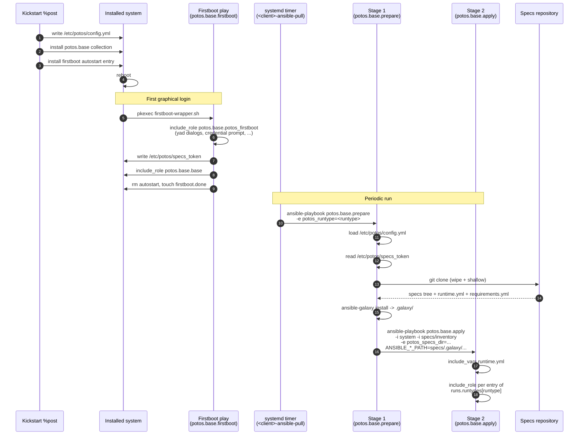

# The Potos Runtime Flow

```mermaid
sequenceDiagram
    autonumber
    participant ISO as Kickstart %post
    participant FS  as Installed system
    participant FB  as Firstboot play<br/>(potos.base.firstboot)
    participant T   as systemd timer<br/>(<client>-ansible-pull)
    participant S1  as Stage 1<br/>(potos.base.prepare)
    participant S2  as Stage 2<br/>(potos.base.apply)
    participant SR  as Specs repository

    ISO->>FS: write /etc/potos/config.yml
    ISO->>FS: install potos.base collection
    ISO->>FS: install firstboot autostart entry
    FS->>FS: reboot
    Note over FS,FB: First graphical login
    FS->>FB: pkexec firstboot-wrapper.sh
    FB->>FB: include_role potos.base.potos_firstboot<br/>(yad dialogs, credential prompt, ...)
    FB->>FS: write /etc/potos/specs_token
    FB->>FS: include_role potos.base.base
    FB->>FS: rm autostart, touch firstboot.done

    Note over T,S2: Periodic run
    T->>S1: ansible-playbook potos.base.prepare<br/>-e potos_runtype=<runtype>
    S1->>S1: load /etc/potos/config.yml
    S1->>S1: read /etc/potos/specs_token
    S1->>SR: git clone (wipe + shallow)
    SR-->>S1: specs tree + runtime.yml + requirements.yml
    S1->>S1: ansible-galaxy install -> .galaxy/
    S1->>S2: ansible-playbook potos.base.apply<br/>-i system -i specs/inventory<br/>-e potos_specs_dir=...<br/>ANSIBLE_*_PATH=specs/.galaxy/...
    S2->>S2: include_vars runtime.yml
    S2->>S2: include_role per entry of<br/>runs.runtypes[runtype]
```