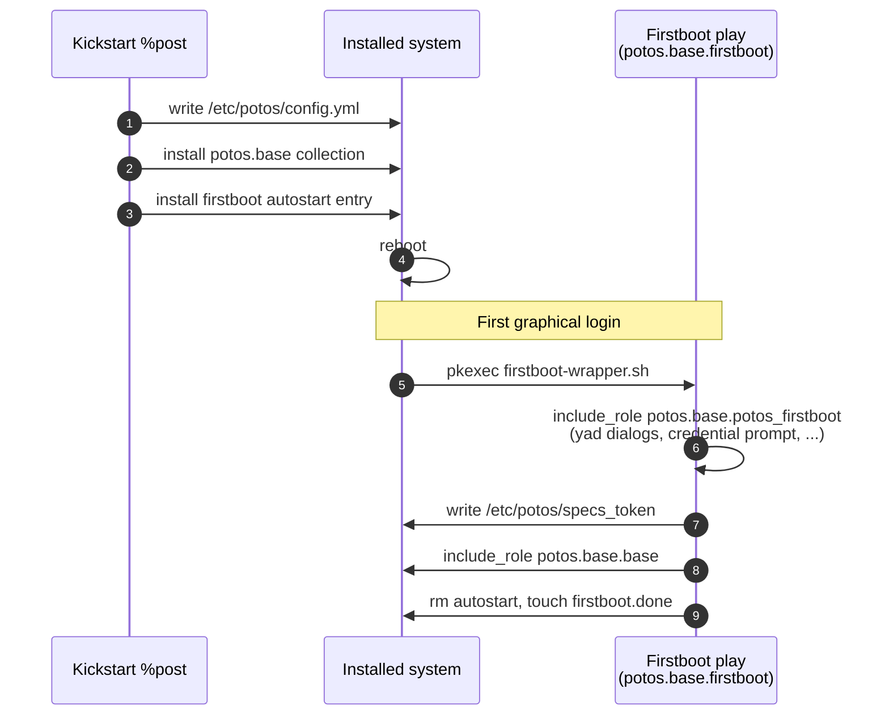

# The Potos Setup Flow

```mermaid
sequenceDiagram
    autonumber
    participant ISO as Kickstart %post
    participant FS  as Installed system
    participant FB  as Firstboot play<br/>(potos.base.firstboot)

    ISO->>FS: write /etc/potos/config.yml
    ISO->>FS: install potos.base collection
    ISO->>FS: install firstboot autostart entry
    FS->>FS: reboot
    Note over FS,FB: First graphical login
    FS->>FB: pkexec firstboot-wrapper.sh
    FB->>FB: include_role potos.base.potos_firstboot<br/>(yad dialogs, credential prompt, ...)
    FB->>FS: write /etc/potos/specs_token
    FB->>FS: include_role potos.base.base
    FB->>FS: rm autostart, touch firstboot.done
```